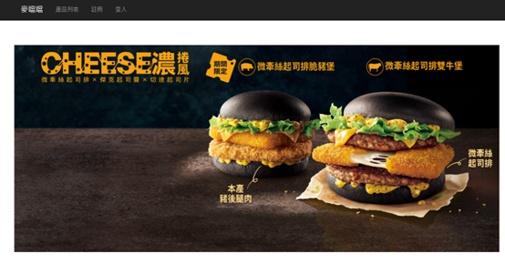
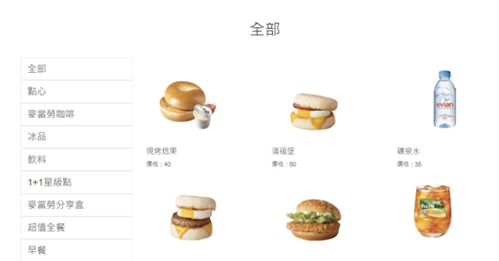
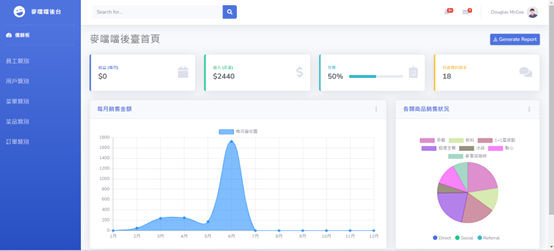
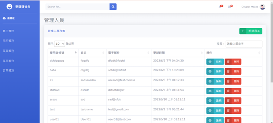
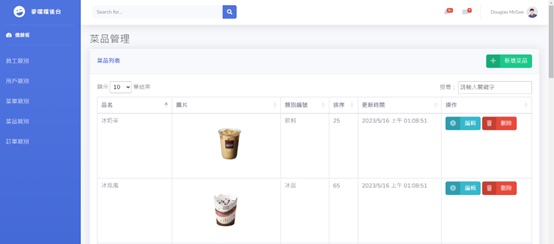

# 麥噹噹 - 前後端一體化購物系統

## 專案簡介

**麥噹噹**是一個基於 C# 的 MVC 架構開發的購物與管理系統，提供了前台購物與後台管理功能。該專案使用內建資料庫來存儲商品、訂單、用戶及員工資訊，並透過 MVC 架構分離前端與後端的邏輯處理，提供靈活且高效的使用體驗。

- **前台 URL**：`http://localhost:50464/SHOP`
- **後台 URL**：`http://localhost:50464/`

## 功能簡介

### 前台功能
在前台，使用者可以進行商品選購並進行結帳：
- **商品瀏覽與選購**：顧客可以查看商品詳情、選擇套餐並將商品加入購物車。
- **購物車功能**：顧客可以查看已選商品、調整數量或移除商品。
- **結帳功能**：選擇配送方式並進行結帳，生成訂單。

### 後台功能
後台管理系統為管理員和員工提供以下管理功能：
- **商品管理**：查看、增加或編輯商品資訊。
- **員工管理**：管理員可查看及管理員工資訊。
- **菜單管理**：編輯不同的套餐選項及詳細資訊。
- **訂單管理**：查看所有訂單，更新訂單狀態並處理訂單。

## 技術架構

### 1. MVC 架構
- **Model（模型）**：定義資料庫結構和業務邏輯，包括員工、用戶、菜單、菜品和訂單等類別。
- **View（視圖）**：負責呈現資料給使用者的界面，包含前台商品頁面和後台管理界面。
- **Controller（控制器）**：負責處理用戶請求，與 Model 互動並更新 View，實現業務邏輯和界面顯示。

### 2. 內建資料庫
- 使用內建的資料庫存儲和管理系統中的各種資料，包括商品、菜品、員工及訂單等。系統啟動時自動初始化並配置數據。

## 主要類別

- **員工類別** (`Employee`)：管理員工的基本資料，如名稱、職位和聯絡資訊。
- **用戶類別** (`User`)：用戶的基本資訊，如名稱、聯絡方式及購物紀錄。
- **菜單類別** (`Menu`)：管理套餐及菜品的選項及細節。
- **菜品類別** (`Dish`)：存儲商品和菜品的名稱、描述和價格。
- **訂單類別** (`Order`)：記錄每筆訂單的詳情，包括商品、總價和支付狀態。

## 安裝與運行

### 系統需求
- **開發環境**：Visual Studio
- **運行環境**：.NET Framework
- **資料庫**：內建資料庫（無需外部安裝）

### 安裝步驟
1. 使用 Visual Studio 打開專案。
2. 編譯並運行專案，系統將自動初始化內建資料庫。
3. 打開瀏覽器並輸入以下 URL 進入系統：
   - **後台管理系統**：`http://localhost:50464/`
   - **前台購物賣場**：`http://localhost:50464/SHOP`

## 使用說明

### 前台操作
1. 訪問 `http://localhost:50464/SHOP` 進入購物賣場。
2. 瀏覽商品，將選擇的商品加入購物車並進行結帳。
3. 結帳後，系統會生成訂單，顯示訂單詳情。

### 後台操作
1. 訪問 `http://localhost:50464/` 進入後台管理系統。
2. 管理員可以新增或編輯商品、管理員工資料、查看及處理訂單。
3. 編輯菜單及套餐內容，確保商品資訊更新準確。

### 圖片展示

## 未來計劃
- **支付功能集成**：添加支付網關以支持線上支付。
- **多語言支援**：增加多語言選項，以適應不同地區的用戶需求。
- **報表生成**：實現銷售與庫存報告功能，提升管理效率。

## 貢獻者

- **作者**：madhu
- **聯絡方式**：qq10455006@gmail.com

